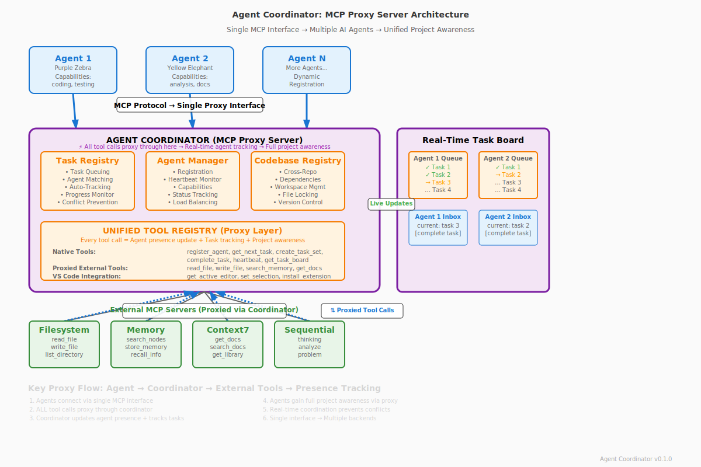

# Agent Coordinator

A **Model Context Protocol (MCP) server** that enables multiple AI agents to coordinate their work seamlessly across codebases without conflicts. Built with Elixir for reliability and fault tolerance.

## What is Agent Coordinator?

Agent Coordinator is a **MCP proxy server** that enables multiple AI agents to collaborate seamlessly without conflicts. As shown in the architecture diagram above, it acts as a **single MCP interface** that proxies ALL tool calls through itself, ensuring every agent maintains full project awareness while the coordinator tracks real-time agent presence.

**The coordinator operates as a transparent proxy layer:**

- **Single Interface**: All agents connect to one MCP server (the coordinator)
- **Proxy Architecture**: Every tool call flows through the coordinator to external MCP servers
- **Presence Tracking**: Each proxied tool call updates agent heartbeat and task status
- **Project Awareness**: All agents see the same unified view of project state through the proxy

**This proxy design orchestrates four core components:**

- **Task Registry**: Intelligent task queuing, agent matching, and automatic progress tracking
- **Agent Manager**: Agent registration, heartbeat monitoring, and capability-based assignment
- **Codebase Registry**: Cross-repository coordination, dependency management, and workspace organization
- **Unified Tool Registry**: Seamlessly proxies external MCP tools while adding coordination capabilities

Instead of agents conflicting over files or duplicating work, they connect through a **single MCP proxy interface** that routes ALL tool calls through the coordinator. This ensures every tool usage updates agent presence, tracks coordinated tasks, and maintains real-time project awareness across all agents via shared task boards and agent inboxes.

**Key Features:**

- **MCP Proxy Architecture**: Single server that proxies ALL external MCP servers for unified agent access
- **Real-Time Activity Tracking**: Live visibility into agent activities: "Reading file.ex", "Editing main.py", "Sequential thinking"
- **Real-Time Presence Tracking**: Every tool call updates agent status and project awareness
- **File-Level Coordination**: Track exactly which files each agent is working on to prevent conflicts
- **Activity History**: Rolling log of recent agent actions with timestamps and file details
- **Multi-Agent Coordination**: Register multiple AI agents (GitHub Copilot, Claude, etc.) with different capabilities
- **Transparent Tool Routing**: Automatically routes tool calls to appropriate external servers while tracking usage
- **Automatic Task Creation**: Every tool usage becomes a tracked task with agent coordination context
- **Full Project Awareness**: All agents see unified project state through the proxy layer
- **External Server Management**: Automatically starts, monitors, and manages MCP servers defined in `mcp_servers.json`
- **Universal Tool Registry**: Proxies tools from all external servers while adding native coordination tools
- **Dynamic Tool Discovery**: Automatically discovers new tools when external servers start/restart
- **Cross-Codebase Support**: Coordinate work across multiple repositories and projects
- **MCP Standard Compliance**: Works with any MCP-compatible AI agent or tool

## Overview



**The Agent Coordinator acts as a transparent MCP proxy server** that routes ALL tool calls through itself to maintain agent presence and provide full project awareness. Every external MCP server is proxied through the coordinator, ensuring unified agent coordination.

### Proxy Architecture Flow

1. **Agent Registration**: Multiple AI agents (Purple Zebra, Yellow Elephant, etc.) register with their capabilities
2. **External Server Discovery**: Coordinator automatically starts and discovers tools from external MCP servers
3. **Unified Proxy Interface**: All tools (native + external) are available through a single MCP interface
4. **Transparent Tool Routing**: ALL tool calls proxy through coordinator → external servers → coordinator → agents
5. **Presence Tracking**: Every proxied tool call updates agent heartbeat and task status
6. **Project Awareness**: All agents maintain unified project state through the proxy layer

## Real-Time Activity Tracking - FANTASTIC Feature!

**See exactly what every agent is doing in real-time!** The coordinator intelligently tracks and displays agent activities as they happen:

### Live Activity Examples

```json
{
  "agent_id": "github-copilot-purple-elephant",
  "name": "GitHub Copilot Purple Elephant",
  "current_activity": "Reading mix.exs",
  "current_files": ["/home/ra/agent_coordinator/mix.exs"],
  "activity_history": [
    {
      "activity": "Reading mix.exs",
      "files": ["/home/ra/agent_coordinator/mix.exs"],
      "timestamp": "2025-09-06T16:41:09.193087Z"
    },
    {
      "activity": "Sequential thinking: Analyzing the current codebase structure...",
      "files": [],
      "timestamp": "2025-09-06T16:41:05.123456Z"
    },
    {
      "activity": "Editing agent.ex",
      "files": ["/home/ra/agent_coordinator/lib/agent_coordinator/agent.ex"],
      "timestamp": "2025-09-06T16:40:58.987654Z"
    }
  ]
}
```

### 🚀 Activity Types Tracked

- **📂 File Operations**: "Reading config.ex", "Editing main.py", "Writing README.md", "Creating new_feature.js"
- **🧠 Thinking Activities**: "Sequential thinking: Analyzing the problem...", "Having a sequential thought..."
- **🔍 Search Operations**: "Searching for 'function'", "Semantic search for 'authentication'"
- **⚡ Terminal Commands**: "Running: mix test...", "Checking terminal output"
- **🛠️ VS Code Actions**: "VS Code: set editor content", "Viewing active editor in VS Code"
- **🧪 Testing**: "Running tests in user_test.exs", "Running all tests"
- **📊 Task Management**: "Creating task: Fix bug", "Getting next task", "Completing current task"
- **🌐 Web Operations**: "Fetching 3 webpages", "Getting library docs for React"

### 🎯 Benefits

- **🚫 Prevent File Conflicts**: See which files are being edited by which agents
- **👥 Coordinate Team Work**: Know when agents are working on related tasks
- **🐛 Debug Agent Behavior**: Track what agents did before encountering issues
- **📈 Monitor Progress**: Watch real-time progress across multiple agents
- **🔄 Optimize Workflows**: Identify bottlenecks and coordination opportunities

**Every tool call automatically updates the agent's activity - no configuration needed!** 🫡😸

### 🏗️ Architecture Components

**Core Coordinator Components:**

- **Task Registry**: Intelligent task queuing, agent matching, and progress tracking
- **Agent Manager**: Registration, heartbeat monitoring, and capability-based assignment
- **Codebase Registry**: Cross-repository coordination and workspace management
- **Unified Tool Registry**: Combines native coordination tools with external MCP tools

**External Integration:**

- **MCP Servers**: Filesystem, Memory, Context7, Sequential Thinking, and more
- **VS Code Integration**: Direct editor commands and workspace management
- **Real-Time Dashboard**: Live task board showing agent status and progress

**Example Proxy Tool Call Flow:**

```text
Agent calls "read_file" → Coordinator proxies to filesystem server →
Updates agent presence + task tracking → Returns file content to agent

Result: All other agents now aware of the file access via task board
```

## 🔧 MCP Server Management & Unified Tool Registry

Agent Coordinator acts as a **unified MCP proxy server** that manages multiple external MCP servers while providing its own coordination capabilities. This creates a single, powerful interface for AI agents to access hundreds of tools seamlessly.

### 📡 External Server Management

The coordinator automatically manages external MCP servers based on configuration in `mcp_servers.json`:

```json
{
  "servers": {
    "mcp_filesystem": {
      "type": "stdio",
      "command": "bunx",
      "args": ["-y", "@modelcontextprotocol/server-filesystem", "/home/ra"],
      "auto_restart": true,
      "description": "Filesystem operations server"
    },
    "mcp_memory": {
      "type": "stdio",
      "command": "bunx",
      "args": ["-y", "@modelcontextprotocol/server-memory"],
      "auto_restart": true,
      "description": "Memory and knowledge graph server"
    },
    "mcp_figma": {
      "type": "http",
      "url": "http://127.0.0.1:3845/mcp",
      "auto_restart": true,
      "description": "Figma design integration server"
    }
  },
  "config": {
    "startup_timeout": 30000,
    "heartbeat_interval": 10000,
    "auto_restart_delay": 1000,
    "max_restart_attempts": 3
  }
}
```

**Server Lifecycle Management:**

1. **Startup**: Reads config and spawns each external server process
2. **Discovery**: Sends MCP `initialize` and `tools/list` requests to discover available tools
3. **Registration**: Adds discovered tools to the unified tool registry
4. **Monitoring**: Continuously monitors server health and heartbeat
5. **Auto-Restart**: Automatically restarts failed servers (if configured)
6. **Cleanup**: Properly terminates processes and cleans up resources on shutdown

### 🛠️ Unified Tool Registry

The coordinator combines tools from multiple sources into a single, coherent interface:

**Native Coordination Tools:**

- `register_agent` - Register agents with capabilities
- `create_task` - Create coordination tasks
- `get_next_task` - Get assigned tasks
- `complete_task` - Mark tasks complete
- `get_task_board` - View all agent status
- `heartbeat` - Maintain agent liveness

**External Server Tools (Auto-Discovered):**

- **Filesystem**: `read_file`, `write_file`, `list_directory`, `search_files`
- **Memory**: `search_nodes`, `store_memory`, `recall_information`
- **Context7**: `get-library-docs`, `search-docs`, `get-library-info`
- **Figma**: `get_code`, `get_designs`, `fetch_assets`
- **Sequential Thinking**: `sequentialthinking`, `analyze_problem`
- **VS Code**: `run_command`, `install_extension`, `open_file`, `create_task`

**Dynamic Discovery Process:**

1. **Startup**: Agent Coordinator starts external MCP server process
2. **Initialize**: Sends MCP `initialize` request → Server responds with capabilities
3. **Discovery**: Sends `tools/list` request → Server returns available tools
4. **Registration**: Adds discovered tools to unified tool registry

This process repeats automatically when servers restart or new servers are added.

### Intelligent Tool Routing

When an AI agent calls a tool, the coordinator intelligently routes the request:

**Routing Logic:**

1. **Native Tools**: Handled directly by Agent Coordinator modules
2. **External Tools**: Routed to the appropriate external MCP server
3. **VS Code Tools**: Routed to integrated VS Code Tool Provider
4. **Unknown Tools**: Return helpful error with available alternatives

**Automatic Task Tracking:**

- Every tool call automatically creates or updates agent tasks
- Maintains context of what agents are working on
- Provides visibility into cross-agent coordination
- Enables intelligent task distribution and conflict prevention

**Example Tool Call Flow:**

```bash
Agent calls "read_file" → Coordinator routes to filesystem server →
Updates agent task → Sends heartbeat → Returns file content
```

## Prerequisites

Choose one of these installation methods:

### Option 1: Docker (Recommended - No Elixir Installation Required)

- **Docker**: 20.10+ and Docker Compose
- **Node.js**: 18+ (for external MCP servers via bun)

### Option 2: Manual Installation

- **Elixir**: 1.16+ with OTP 26+
- **Mix**: Comes with Elixir installation
- **Node.js**: 18+ (for external MCP servers via bun)

## ⚡ Quick Start

### Option A: Docker Setup (Easiest)

#### 1. Get the Code

```bash
git clone https://github.com/your-username/agent_coordinator.git
cd agent_coordinator
```

#### 2. Run with Docker Compose

```bash
# Start the full stack (MCP server + NATS + monitoring)
docker-compose up -d

# Or start just the MCP server
docker-compose up agent-coordinator

# Check logs
docker-compose logs -f agent-coordinator
```

#### 3. Configuration

Edit `mcp_servers.json` to configure external MCP servers, then restart:

```bash
docker-compose restart agent-coordinator
```

### Option B: Manual Setup

#### 1. Clone the Repository

```bash
git clone https://github.com/your-username/agent_coordinator.git
cd agent_coordinator
mix deps.get
```

#### 2. Start the MCP Server

```bash
# Start the MCP server directly
./scripts/mcp_launcher.sh

# Or in development mode
mix run --no-halt
```

### 3. Configure Your AI Tools

#### For Docker Setup

If using Docker, the MCP server is available at the container's stdio interface. Add this to your VS Code `settings.json`:

```json
{
  "github.copilot.advanced": {
    "mcp": {
      "servers": {
        "agent-coordinator": {
          "command": "docker",
          "args": ["exec", "-i", "agent-coordinator", "/app/scripts/mcp_launcher.sh"],
          "env": {
            "MIX_ENV": "prod"
          }
        }
      }
    }
  }
}
```

#### For Manual Setup

Add this to your VS Code `settings.json`:

```json
{
  "github.copilot.advanced": {
    "mcp": {
      "servers": {
        "agent-coordinator": {
          "command": "/path/to/agent_coordinator/scripts/mcp_launcher.sh",
          "args": [],
          "env": {
            "MIX_ENV": "dev"
          }
        }
      }
    }
  }
}
```
